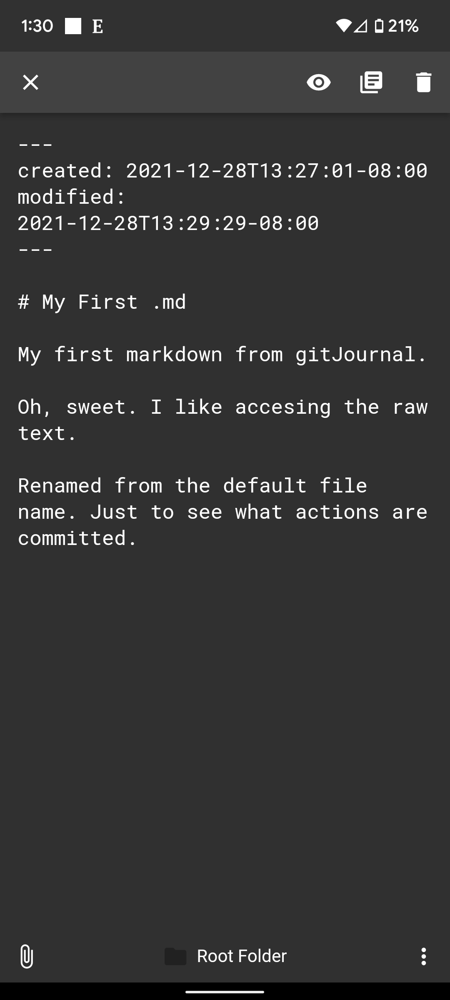

My first markdown from gitJournal.

# Raw Text Header

Oh, sweet. I like accesing the raw text. 

Renamed from the default file name. Just to see what actions are committed.

### my first checklist

[ ] my first checklist item
[x] my next ✅list item

---

- already knocked off the second item.
- that's called eating the frog
- that's how you get it done

#productivity

